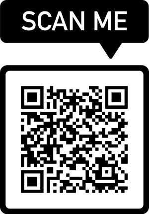

# **Silam SOMASUNDARAM**
**Senior Cyber Security Engineer**  |  **Security Operation Specialist** 
**| Incident Response | Application Security Engineer**  
📍 Aix-en-Provence, France | Willing to relocate / hybrid  
📧 Somasundaram-Cyber-Sec@proton.me  
🔗 [LinkedIn](https://www.linkedin.com/in/silambarasan-somasundaram)
    

---

## **About Me**
I am a Senior Cyber Security Engineer with 9+ years of experience in **SOC L2/L3, Incident Response, Detection Engineering, Cloud Security (Azure), IAM, Vulnerability Management,Threat intelligence,Application Security**.

I specialize in:
- Detecting and responding to complex security incidents,
- Implementing Security devlopment life cycle and performing application security assessment
- Improving detection coverage (SIEM / EDR / NDR),
- Hardening identity & cloud environments (Azure AD / RBAC / MFA / Zero Trust),
- Supporting security teams and mentoring analysts.

I am seeking an **internal security engineer / Security Operational Specialist / cyber defense role** where I can bring operational impact and enhance the organization's defensive maturity.

---

## **Core Competencies**
## 🛡️ Technical Skills Overview

### **Threat Intelligence & Malware Analysis**
- Phishing campaign analysis (URLs, attachments, spoofing patterns)
- IOC / IOA extraction and enrichment
- Malware & document investigation (sandbox + static indicators)
- TTP mapping aligned to **MITRE ATT&CK**
- Cybersquatting detection & monitoring
- Data leak exposure tracking and mitigation

---

### **Detection Engineering & Incident Response**
- SIEM / EDR rule tuning & behavioral signature development
- False Positive / False Negative reduction
- Playbook execution aligned to **NIST 800-61**
- Alert triage & escalation (SOC L1/L2 support → L3 decision-making)
- Investigation workflow standardization and documentation

---

### **Application & Infrastructure Security**
- Code review (white-box & grey-box)
- Authentication & session security flow analysis
- Secure SDLC & CI/CD pipeline safeguards
- **OWASP ASVS / MASVS** methodology in review processes
- SAST / DAST / SCA tool integration and policy enhancements

---

### **Vulnerability & Risk Management**
- **CVE / CVSS / CWE** vulnerability reasoning and ranking
- Exposure prioritization based on business impact
- Remediation guidance for Ops / Dev / Cloud teams
- Reporting tailored for technical & non-technical audiences

---

### **Scripting & Analysis Automation**
- Python (automation, investigation helpers, scanning logic)
- Regex for log and IOC pattern extraction
- Familiarity with **YARA** for malware behavior classification

---

### **Programming Languages**

- **Python** | Automation, threat analysis scripts |
- **PowerShell** | Windows IR & hardening automation |
- **Bash** | Linux automation & triage |
- **JavaScript / TypeScript / Go / .NET** | AppSec analysis context for reviews |

---

### **Functional Skills**

- Project coordination, prioritization & KPI tracking (PowerBI, Excel)
- Clear communication and technical documentation
- Autonomy, initiative, knowledge sharing, teamwork

---

## **Professional Experience**

### **Technical Security Lead** — *Devoteam (long-term embedded mission)*  
**2021 – Present | France**

Lead Security Consultant responsible for **Azure Security**, **SOC Operations**, and **DevSecOps** strategy and implementation.

 **Leadership & Enablement Contributions**

- Designed and administered **security recruitment evaluation frameworks**, including hands-on technical tests.
- Built a **SOC lab environment** and demonstrated a **CTI Proof-of-Concept** for pre-sales and internal capability development.
- Conducted **security tooling assessments** and aligned solution selection with business risk and architectural constraints.
- Led **knowledge-sharing workshops** (Azure Sentinel, CI/CD security, data compliance) for **40+ engineers across teams**.
- Mentored junior engineers in **secure coding**, **vulnerability analysis**, and **application security fundamentals**.

**Key Achievements - MISSIONS CMACGM && ADSN**
- Designed a **Cyber Threat Intelligence (CTI) service model** and trained SOC teams.
- Led **Purple Team attack simulations** using Python + EDR telemetry.
- Maintained **continuous monitoring** of vulnerabilities (CERT-FR / ANSSI / CISA KEV).
- Improved incident response documentation and crisis coordination workflows.
- Maintained continuous **vulnerability monitoring** and delivered actionable **risk reports** to guide remediation prioritization.
- Aligned internal teams on vulnerability impact and coordinated timely **patching and configuration hardening**.
- Enhanced **detection capabilities** through proactive **Threat Intelligence** integration (data leaks, IOC feeds, TTP tracking).
- Executed targeted **threat hunting investigations**, contributing to earlier detection and reduced incident impact.

**Key Security Projects**
  - Key Vault Implementation for SQL Server database to implement Bring your own Key concept - **Azure Key Vault**
  - Identity Access Management Migration for SAP Business application with **Azure Active Directory and OKTA**
  - Implementing and Developping Technical Cyber Threat Intelligence Services **MISP** and **THEHIVE**
  - Developping and Implementing Security gates via CI/CD to ensure the security of the application
  - Implement SOC lab with MISP and THEHIVE in docker environment for proof of concept
  - Implemented Single sign On migration for application LDAP accounts. 

---

### **Security Engineer** — *Enablon (Wolters Kluwer)*  
**2019 – 2021 | Paris, France**

- Integrated **SAST/DAST/SCA** into CI/CD → **200+ critical vulnerabilities remediated**.
- Automated container & image security → **~60% reduction in container incidents**.
- Hardened runtime environments & improved secure deployment pipelines.
- Implemented **OKTA + SAML IAM restructuring** for SaaS applications.

---

### **Application Security Assessment Assistant** — *Société Générale*  
**2018 | Paris**

- Performed application penetration testing using OWASP ASVS/MASVS.
- Produced vulnerability reports and remediation recommendations for engineering teams.

---

### **Security Analyst** — *Wipro Technologies*  
**2015 – 2017 | Chennai, India**

- Performed infrastructure vulnerability management & firewall policy audits.
- Handled security incident triage using IBM QRadar and log correlation tools.
- Conducted source code security reviews (white-box / grey-box): reading code, identifying logic flaws, and reviewing authentication flows and session management   mechanisms

---

## 🎓 **Certifications**
- **CISSP - Exam plannned on Jan 2026**
- **Microsoft Azure Security Engineer (AZ-500)**
- **CEH (EC-Council)**
- **CySA+**
- **Azure Fundamentals**
- **GenAI Security Essentials**

---

## 🎓 **Education**
**Master of Science in Cybersecurity** — EPITA, France  
**Master of Computer Applications** — Pondicherry University  
**Bachelor of Computer Applications** — Thiruvalluvar University

---

## 🌐 Languages
- 🇬🇧 English — Fluent
- 🇫🇷 French — Professional Working Proficiency
- 🇮🇳 Tamil — Native

---

## 🎯 Interests

- 🎨 Art & Culture  
- 🧘‍♂️ Meditation  
- 🏸 Badminton
- 🥘 World Cuisine Exploration

---

## **Contact**
📧 **Email:** Somasundaram-Cyber-Sec@proton.me  
🔗 **LinkedIn:** https://www.linkedin.com/in/silambarasan-somasundaram
🔗 **GithHub-Project-Perso:** https://github.com/seenu0991
